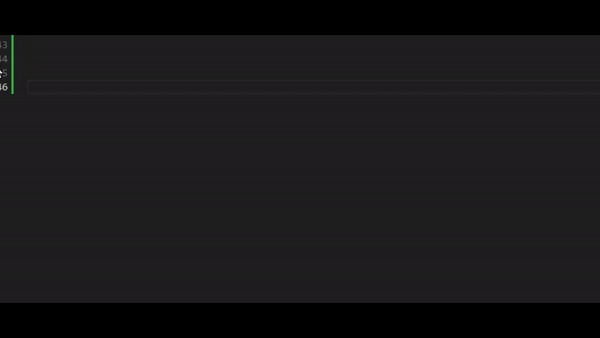
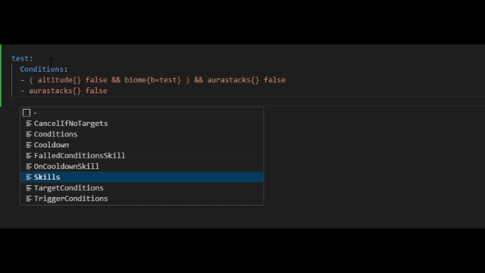
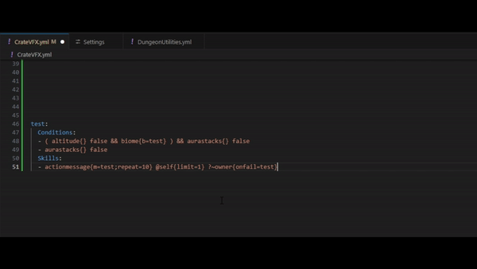

# What is MythicScribe?

MythicScribe is a VisualStudio Code extension that allows you to connect your MythicMobs configurations directly with its documentation, providing hover texts with informations regarding the pointed object and autocompletions for some of its syntax

## Features

### Autocompletions

### Hover Informations

## Extension Settings

This extension contributes the following settings:

* `MythicScribe.alwaysEnabled`: When enabled, this extension will no longer check for a /MythicMobs/ folder to be uptream in order to parse the file
* `MythicScribe.enableEmptyBracketsAutomaticRemoval`: Enable the removal of empty curly brackets `{}` by moving the cursor past them
* `MythicScribe.regexForMythicmobsFile`: determine which files are Mythicmobs ones based on a custom regex
* `MythicScribe.regexForMetaskillFile`: determine which files are Metaskill ones based on a custom regex